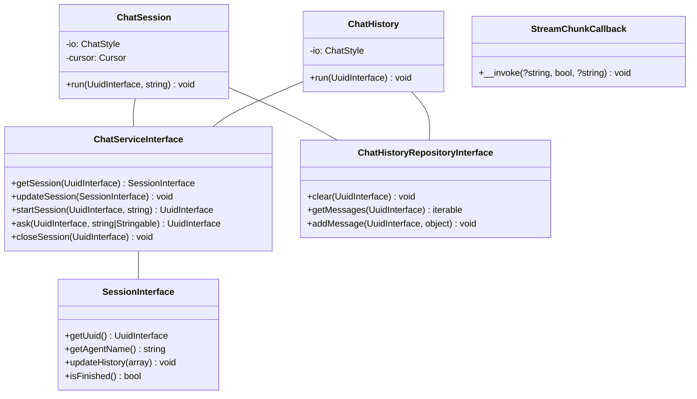

# LLM Agents CLI Chat

This cool package gives you a CLI chat interface to chat with LLM agents. It's built on top of Symfony Console, so you
know it's gonna be smooth sailing.

## What's this all about?

- Start chat sessions with different agents
- Send messages and get responses
- Handle tool calls and their results
- Display chat history

It's perfect for testing your agents or building CLI-based chatbots.

## Installation

You can install the package via Composer:

```bash
composer require llm-agents/cli-chat
```

## Configuration

This package doesn't require much configuration. The main things you'll need to set up are:

- An implementation of `LLM\Agents\Chat\ChatServiceInterface`
- An implementation of `LLM\Agents\Chat\ChatHistoryRepositoryInterface`
- An implementation of `LLM\Agents\Chat\SessionInterface`
- Your agent registry
- Your tool registry

## Usage

To use this package, you need to create two console commands in your application:

- A command to start a chat session
- A command to display chat history

Here's how you can set these up using Spiral framework:

> **Note:** You can use any framework or library that supports Symfony Console commands.

### Chat Session Command

This command starts a new chat session:

```php
<?php

declare(strict_types=1);

namespace App\Endpoint\Console;

use LLM\Agents\Agent\AgentRegistryInterface;
use LLM\Agents\Chat\ChatHistoryRepositoryInterface;
use LLM\Agents\Chat\ChatServiceInterface;
use LLM\Agents\Chat\Console\ChatSession;
use LLM\Agents\Tool\ToolRegistryInterface;
use Ramsey\Uuid\Uuid;
use Spiral\Console\Attribute\AsCommand;
use Spiral\Console\Command;
use Spiral\Console\Console;
use Symfony\Component\Console\Cursor;

#[AsCommand(
    name: 'chat',
    description: 'Chat session'
)]
final class ChatCommand extends Command
{
    public function __invoke(
        AgentRegistryInterface $agents,
        ChatServiceInterface $chat,
        Console $console,
        ChatHistoryRepositoryInterface $chatHistory,
        ToolRegistryInterface $tools,
    ): int {
        $cursor = new Cursor($this->output);
        $cursor->clearScreen();
        $console->run(command: 'agent:list', output: $this->output);

        $chat = new ChatSession(
            input: $this->input,
            output: $this->output,
            agents: $agents,
            chat: $chat,
            chatHistory: $chatHistory,
            tools: $tools,
        );

        $chat->run(accountUuid: Uuid::fromString('00000000-0000-0000-0000-000000000000'));

        return self::SUCCESS;
    }
}
```

### Chat History Command

This command displays the chat history for a specific session:

```php
<?php

declare(strict_types=1);

namespace App\Endpoint\Console;

use LLM\Agents\Chat\ChatHistoryRepositoryInterface;
use LLM\Agents\Chat\ChatServiceInterface;
use LLM\Agents\Chat\Console\ChatHistory;
use Ramsey\Uuid\Uuid;
use Spiral\Console\Attribute\Argument;
use Spiral\Console\Attribute\AsCommand;
use Spiral\Console\Command;

#[AsCommand(
    name: 'chat:session',
    description: 'Chat session'
)]
final class ChatWindowCommand extends Command
{
    #[Argument(name: 'session_uuid')]
    public string $sessionUuid;

    public function __invoke(
        ChatHistoryRepositoryInterface $chatHistory,
        ChatServiceInterface $chatService,
    ): int {
        $chatWindow = new ChatHistory(
            input: $this->input,
            output: $this->output,
            chatHistory: $chatHistory,
            chat: $chatService,
        );

        $chatWindow->run(Uuid::fromString($this->sessionUuid));

        return self::SUCCESS;
    }
}
```

To use these commands, you'll need to register them with your application's console kernel or command loader, depending
on your framework.

## Class Diagram

Here's a quick look at how everything fits together:



## Contributing

We'd love your help to make this package even better! Here's how you can contribute:

1. Fork the repository
2. Write some awesome code
3. Create a new Pull Request

Please make sure your code follows PSR-12 coding standards and include tests for any new features.

## License

This package is open-sourced software licensed under the MIT license. Feel free to use it, modify it, and share it!

---

That's all, folks! If you have any questions or run into any issues, don't hesitate to open an issue on GitHub.